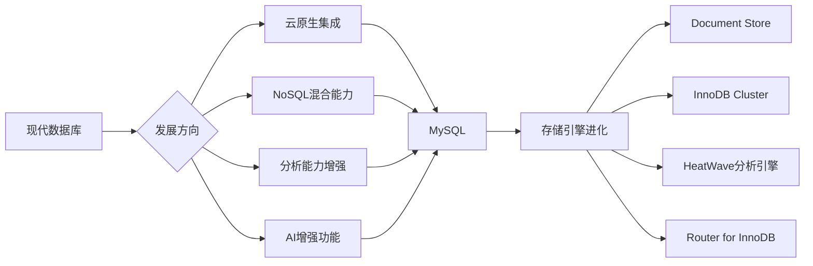

# 🐬 MySQL 专业文档中心

  <h2>世界最受欢迎的开源关系型数据库</h2>
  
<strong>高性能 • 易用性 • 高并发 • 广泛支持</strong>

---

## 📚 快速导航

  

    <h3>🚀 安装</h3>
    
详细了解 MySQL 的安装部署方法。

    <a href="./install" class="btn">详情</a>
  

  
  

    <h3>⚙️ 配置</h3>
    
掌握 MySQL 的性能配置和参数优化。

    <a href="./config" class="btn">详情</a>
  

  
  

    <h3>🔐 权限管理</h3>
    
深入理解 MySQL 中的用户权限和认证策略。

    <a href="./PrivilegeManagement" class="btn">详情</a>
  

  
  

    <h3>👥 用户管理</h3>
    
学习如何高效地管理数据库用户账户。

    <a href="./users" class="btn">详情</a>
  

  
  

    <h3>🔄 主从复制</h3>
    
深入理解主从复制、半同步复制等数据同步机制。

    <a href="./replication" class="btn">详情</a>
  

  
  

    <h3>🛡️ 高可用</h3>
    
探索 MySQL Group Replication、MGR 等 HA 方案。

    <a href="./MGR" class="btn">详情</a>
  

  
  

    <h3>📊 监控</h3>
    
使用 exporter 等工具进行数据库性能监控。

    <a href="./exporter" class="btn">详情</a>
  

  
  

    <h3>🔍 压测</h3>
    
利用 mysqlslap 等工具进行性能压力测试。

    <a href="./mysqlslap" class="btn">详情</a>
  

---

## MySQL 简介

MySQL 是世界上最受欢迎的开源关系型数据库管理系统之一，具有高性能、易用性和广泛的支持等特点。自 1995 年首次发布以来，MySQL 已经发展成为一个强大而稳定的数据库解决方案，被广泛用于各种规模的应用程序，从小型网站到大型企业级应用都有其身影。

### 核心特性

- **开源免费**：GPL 许可协议，社区版免费使用
- **高性能引擎**：支持多种存储引擎，包括 InnoDB、MyISAM 等
- **高并发处理**：卓越的读写性能，适用于高并发场景
- **数据一致性**：ACID 特性保证事务完整性
- **易于扩展**：支持水平拆分和垂直扩展
- **跨平台支持**：支持所有主流操作系统平台

### 企业应用场景

- ✅ **Web 应用开发**
- ✅ **电商平台数据管理**
- ✅ **数据分析与报告**
- ✅ **内容管理系统(CMS)**
- ✅ **日志数据存储**
- ✅ **API 数据层服务**

## 技术规格对比

| 功能           | PostgreSQL | MySQL | Oracle | SQL Server |
| -------------- | ---------- | ----- | ------ | ---------- |
| 社区活跃度     | 🌟         | ✅    | ⚠️     | ✅         |
| 易用性         | ⚠️         | 🌟    | ⚠️     | ✅         |
| 企业支持       | ⚠️         | ✅    | ✅     | ✅         |
| SQL 标准兼容   | ✅         | ⚠️    | ⚠️     | ⚠️         |
| NoSQL 扩展支持 | ⚠️         | ✅    | 🌟     | ✅         |
| 开源自由度     | ✅         | ✅    | ❌     | ❌         |

🌟 卓越级 &nbsp;&nbsp; ✅ 优秀级 &nbsp;&nbsp; ⚠️ 中等级 &nbsp;&nbsp; ❌ 较弱级

## 何时使用 MySQL？

### 推荐选用场景

#### 1. Web 应用开发

- 大多数 Web 应用的首选数据库
- 高效处理在线事务处理(OLTP)
- 网站访问量大、读取频率高的场景

#### 2. 快速原型开发

- 丰富的驱动和连接器支持
- 与 PHP、Python、Java 等语言深度集成
- 简单直观的管理工具

#### 3. 高读取并发需求

- 优秀的读性能，特别适合读多写少的场景
- 支持多种复制方式优化读取负载
- 高效的缓存机制

#### 4. 成本效益考虑

- 社区版完全免费商用
- 广泛的技术资料和社区支持
- 低运营和维护成本

### 可考虑替代的情况

- 要求强 ACID 合规性的金融交易系统
- 复杂的关系建模和数据类型处理需求
- 需要大量自定义扩展功能的场景

## 发展趋势

### MySQL 的最新演进方向：

- **云原生优化** - 专门针对云环境进行性能和可扩展性改进
- **分析功能增强** - MySQL HeatWave 等内置数据分析引擎
- **向量化处理** - 支持列式存储，优化分析工作负载
- **文档数据库兼容** - 原生 JSON 数据类型的进一步增强
- **分布式架构** - MySQL Group Replication 和 InnoDB Cluster

## 版本规划

| 版本          | 发布时间 | 支持期限     | 主要特性                     |
| ------------- | -------- | ------------ | ---------------------------- |
| **MySQL 5.7** | 2013     | 2023 年结束  | JSON 支持、虚拟列、性能改进  |
| **MySQL 8.0** | 2018     | 至少至 2026  | 文档存储、窗口函数、安全改进 |
| **MySQL 8.4** | 2024     | 预计 2029 年 | AI 集成、云优化、安全增强    |

**最新推荐版本**：`MySQL 8.4`, `MySQL 8.0 LTS`

## 最佳实践

### 性能优化黄金法则

1. **合理选择存储引擎**

   - 使用 InnoDB 处理事务和外键相关的应用
   - 在纯读取或临时表场景下考虑 MyISAM
   - 了解不同存储引擎的特点和使用场景

2. **优化查询策略**

   - 合理创建索引，关注复合索引顺序
   - 避免全表扫描和过多的 JOIN
   - 合理使用缓存机制提升性能

3. **配置参数调优**
   - 调整缓冲池大小(buffer pool size)
   - 优化连接数和线程配置
   - 合理设置日志参数平衡性能与安全

### 安全配置要点

1. **权限访问控制**

   - 遵循最小权限原则分配用户权限
   - 定期审查和清理不必要的用户账号
   - 合理设置 IP 限制和网络访问策略

2. **数据保护策略**
   - 启用审计日志监控重要操作
   - 配置 SSL/TLS 加密传输数据
   - 考虑透明数据加密保护静态数据

> ⭐ 预知更多实践细节，可参考左侧菜单中对应专题章节
