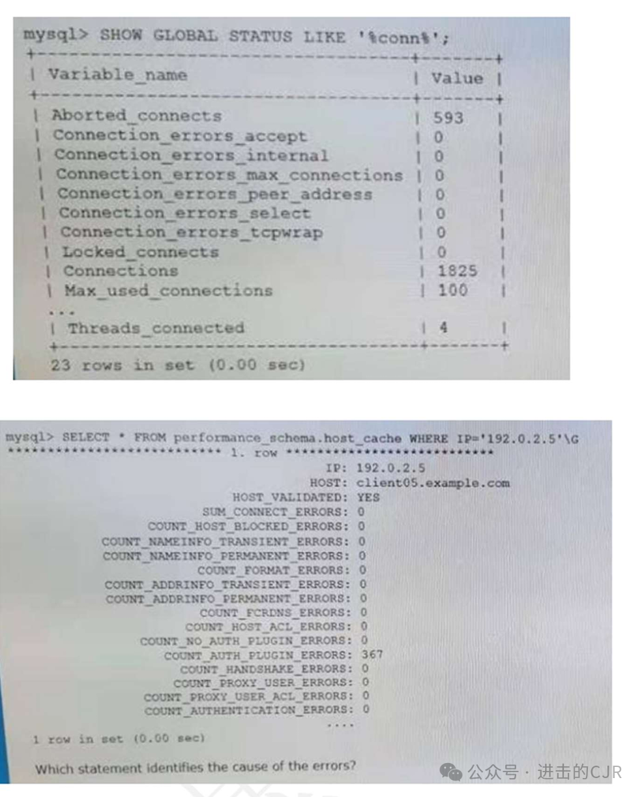
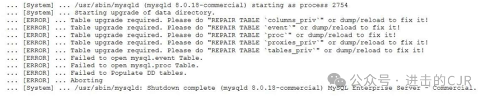
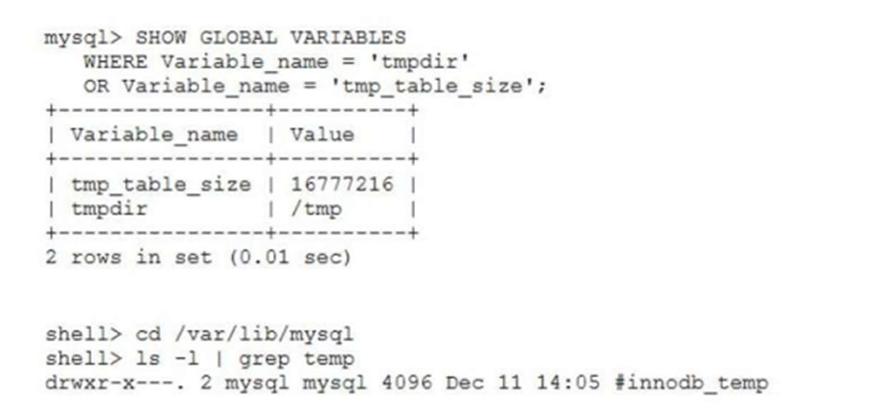

```
E)SELECT id, name FROM user WHERE id=23 OR id=32 AND 1=1;  
A)SELECT user, passwd FROM members WHERE user = ' ? ' ; INSERT INTO members ('user' , 'passwd' ) VALUES ('bob@example.com' , 'secret' ) ;-- '; 
D)SELECT id, name FROM user WHERE id=23 OR id=32 OR 1=1;  
C)SELECT id, name FROM user WHERE user.id= (SELECT members.id FROM members) ;  
F)SELECT email, passwd FROM members WHERE email = 'INSERT INTO members('email' , ' passwd ' ) VALUES ('bob@example.com' , 'secret') ;-- ';  
B)SELECT user, phone FROM customers WHERE name = ' \\; DROP TABLE users; -- '; 
```
41 
```
On examination, your MySQL installation datadir has become recursively world 
read/write/executable. What are two major concerns of running an installation with incorrect file privileges? 

C)SQL injections could be used to insert bad data into the database.  
D)Extra startup time would be required for the MySQL server to reset the privileges.（没有这个功能） 
 
A)Data files could be deleted. (datafiles)  
E)MySQL binaries could be damaged, deleted, or altered.（basedir 中才有 MySQL binaries）  
B)Users could overwrite configuration files.(mysqld-auto.ccnf) 
```

42
```
Choose two.Which two methods can be used to determine whether a query uses the hash join 
algorithm? 
A. EXPLAIN FORMAT=TREE 
B. EXPLAIN FORMAT=JSON 
C. EXPIAIN ANALYZE  
D. EXPLAIN FORMAT=TRADIRIONAL 
E. EXPIAIN without any formatting argument
```

71
Choose two.You must export data from a set of tables in the world_x database. Examine this set of 
tables:Tables (country, countryinfo, location)Which two options will export data into one or more 
files? 
C)shell> mysqlexport world_x country countryinfo location > mydump.sql 
A)shell> mysqldump world_x country countryinfo location > mydump.sql
E)shell> mysql --batch world_x.country world_x.countryinfo world_x.1ocation > mydump.sql 
D)mysql> CLONE LOCAL DATA DIRECTORY = '/var/lib/mysql/world_x/country' ; mysql> CLONE 
LOCAL DATA DIRECTORY = '/var/lib/mysql/world_x/countryinfo' ; mysql> CLONE LOCAL DATA 
DIRECTORY = '/var/lib/mysql/world_x/location' ; 
B)mysql> SELECT * INTO OUTFILE '/output/country. txt' FROM world_x.country; mysql> SELECT * 
INTO OUTFILE '/output/countryinfo. txt' FROM world_x.countryinfo; mysql> SELECT * INTO OUTFILE 
'/output/location. txt' FROM world_x.location; 

72
Choose three.Which are three benefits of using mysqlbackup instead of mysqldump? 
B)mysqlbackup allows logical backups with concurrency resulting in faster backups and restores. 
A)mysqlbackup can perform partial backup of stored programs. 
F)mysqlbackup restores data from physical backups, which are faster than logical backups. 
C)mysqlbackup integrates tape backup and has the virtual tape option. 
E)mysqlbackup does not back up MySQL system tables, which shortens backup time.
D)mysqlbackup can back up tables with the InnoDB engine without blocking reducing wait times 
due to contention. 

73
Choose two.All MySQL Server instances belonging to InnoDB Cluster have SSL configured and 
enabled. You must configure InnoDB Cluster to use SSL for group communication. .Which two 
statements are true? 
F)Configuring SSL group communication also configures SSL distributed recovery. 
D)SSL group communication can be enabled for an existing cluster, one instance at time, by setting 
group_replication_ssl_mode. 
E)SSL group communication requires the use of an additional set of parameters 
group_replication_recovery_*.
B)If only some InnoDB Cluster members are enabled for SSL group communication, and --ssl
mode=PREFERRED, communication will fall back to unencrypted connection. 
A)An existing InnoDB Cluster must be dissolved and created from scratch to enable SSL for group 
communication. 
C)SSL group communication must be enabled at cluster creation time by specifying createCluster 
(memberSslMode:'REQUIRED'). 

74

After installing MySQL 8.0 on Oracle Linux 7, you initialize the data directory with the mysqld -
initialize command.Which two will assist in locating the root password? 
C)the root password inserted in the error log set by the --log-error=file_name variable 
A)the root_pw variable stored in the mysql.install table 
B)the root password displayed on the screen via a Warning message  
D)the root password written to the /root/.my.cnf file 
E)as root, executing the SHOW PASSWORD command by using the SHA-256 password encryption 
plugin 
75 
Choose two.Identify two ways to significantly improve data security. 
B)Use a private network behind a firewall. 
D)Configure MySQL to have only one administrative account. 
E)Configure mysqld to use only local disks or attached disks and to have its own account in the host 
system. 
A)Configure mysqld to run as the system admin account, such as root. 
C)Configure mysqld to use only networked disks. 

76
Which two are valid uses for binary logs on a MySQL instance? 
E)recording the order in which queries are issued 
D)point-in-time recovery 
A)logging the duration and locks for all queries 
B)replication 
C)audit of all queries 

77
Choose two.Which two are features of MySQL Enterprise Firewall? 
B) modifying SQL statement dynamically with substitutions 
A) blocking of potential threats by configuring pre- approved whitelists 
C) recording incoming SQL statement to facilitate the creation of a whitelist of permitted 
commands 
D) automatic locking of user accounts who break your firewall 
E) provides stateless firewall access to TCP/3306 

78
Choose three.Which three methods display the complete table definition of an InnoDB table? 
E)SELECT * FROM table 1\G 
F)SHOW CREATE TABLE 
C)mysqldump --no-data schema table 
A)hexdump -v -C table.frm 
B)REPAIR TABLE table USE_FRM 
D)Query the Information Schema. 

79
Which two statements are true about the mysql_config_editor program?  
F)It manages the configuration of the MySQL Firewall feature. 
C)It can move datadir to a new location. 
B)It manages the configuration of client programs. (only work for mysql client) 
G)It can be used to create and edit SSL certificates and log locations.  
E)It will use client options by default unless you provide –login-path. (mysql = mysql –login
path=client)  
D)It manages the configuration of user privileges for accessing the server. 
A)It provides an interface to change my.cnf files.

80
Choose three.A MySQL server is monitored using MySQL Enterprise Monitor 's agentless 
installation.Which three features are available with this installation method? 
C) CPU utilization 
B) security-related advisor warnings 
E) MySQL Query Analysis data 
D) disk usage and disk characteristics including disk advisors warnings 
A) MySQL Replication monitoring 
G) network-related information and network characteristics 
F) operating system memory utilization 

81
Choose four.Which four are types of information stored in the MySQL data dictionary? 
H)access control lists  
C)performance metrics  
B)server configuration rollback  
F)view definitions  
G)table definitions.  
E)InnoDB buffer pool LRU management data  
A)server runtime configuration  
D)stored procedure definitions 

82
Choose two.Examine this statement:mysql>DROP ROLE r_role1, r_role2 ; Which two are true? 
B)You must revoke all privileges from r_role1 and r_role2 before dropping the roles. 
C)It fails if at least one of the roles does not exist. 
D)Existing connections can continue to use the roles' privileges until they reconnect. 
F)It fails if any of the roles is specified in the mandatory_roles variable. 
A)You must revoke r_role1 and r_role2 from all users and other roles before dropping the roles. 
E)It fails if you do not have the ADMIN OPTION of the roles r_role1 and r_role2. 

83
Choose two.Examine this statement:mysql>DROP ROLE r_role1, r_role2 ; Which two are true? 
B)You must revoke all privileges from r_role1 and r_role2 before dropping the roles. 
C)It fails if at least one of the roles does not exist. 
D)Existing connections can continue to use the roles' privileges until they reconnect. 
F)It fails if any of the roles is specified in the mandatory_roles variable. 
A)You must revoke r_role1 and r_role2 from all users and other roles before dropping the roles. 
E)It fails if you do not have the ADMIN OPTION of the roles r_role1 and r_role2. 

84
Choose two.Examine this statement:mysql>DROP ROLE r_role1, r_role2 ; Which two are true? 
B)You must revoke all privileges from r_role1 and r_role2 before dropping the roles.  
C)It fails if at least one of the roles does not exist. 
D)Existing connections can continue to use the roles' privileges until they reconnect.  
F)It fails if any of the roles is specified in the mandatory_roles variable. 
A)You must revoke r_role1 and r_role2 from all users and other roles before dropping the roles.  
E)It fails if you do not have the ADMIN OPTION of the roles r_role1 and r_role2.  

85
Choose two.Examine this statement:mysql>DROP ROLE r_role1, r_role2 ; Which two are true? 
B)You must revoke all privileges from r_role1 and r_role2 before dropping the roles.  
C)It fails if at least one of the roles does not exist. 
D)Existing connections can continue to use the roles' privileges until they reconnect.  
F)It fails if any of the roles is specified in the mandatory_roles variable. 
A)You must revoke r_role1 and r_role2 from all users and other roles before dropping the roles.  
E)It fails if you do not have the ADMIN OPTION of the roles r_role1 and r_role2.  

86
Choose two.Examine this statement:mysql>DROP ROLE r_role1, r_role2 ; Which two are true? 
B)You must revoke all privileges from r_role1 and r_role2 before dropping the roles.  
C)It fails if at least one of the roles does not exist. 
D)Existing connections can continue to use the roles' privileges until they reconnect.  
F)It fails if any of the roles is specified in the mandatory_roles variable. 
A)You must revoke r_role1 and r_role2 from all users and other roles before dropping the roles.  
E)It fails if you do not have the ADMIN OPTION of the roles r_role1 and r_role2.  

87
Choose two.Examine this statement:mysql>DROP ROLE r_role1, r_role2 ; Which two are true? 
B)You must revoke all privileges from r_role1 and r_role2 before dropping the roles.  
C)It fails if at least one of the roles does not exist. 
D)Existing connections can continue to use the roles' privileges until they reconnect.  
F)It fails if any of the roles is specified in the mandatory_roles variable. 
A)You must revoke r_role1 and r_role2 from all users and other roles before dropping the roles.  
E)It fails if you do not have the ADMIN OPTION of the roles r_role1 and r_role2.  

88
Choose two.Examine this statement:mysql>DROP ROLE r_role1, r_role2 ; Which two are true? 
B)You must revoke all privileges from r_role1 and r_role2 before dropping the roles.  
C)It fails if at least one of the roles does not exist. 
D)Existing connections can continue to use the roles' privileges until they reconnect.  
F)It fails if any of the roles is specified in the mandatory_roles variable. 
A)You must revoke r_role1 and r_role2 from all users and other roles before dropping the roles.  
E)It fails if you do not have the ADMIN OPTION of the roles r_role1 and r_role2.  

89
Choose two.Examine this statement:mysql>DROP ROLE r_role1, r_role2 ; Which two are true? 
B)You must revoke all privileges from r_role1 and r_role2 before dropping the roles.  
C)It fails if at least one of the roles does not exist. 
D)Existing connections can continue to use the roles' privileges until they reconnect.  
F)It fails if any of the roles is specified in the mandatory_roles variable. 
A)You must revoke r_role1 and r_role2 from all users and other roles before dropping the roles.  
E)It fails if you do not have the ADMIN OPTION of the roles r_role1 and r_role2.  

90
Choose two.Examine this statement:mysql>DROP ROLE r_role1, r_role2 ; Which two are true? 
B)You must revoke all privileges from r_role1 and r_role2 before dropping the roles.  
C)It fails if at least one of the roles does not exist. 
D)Existing connections can continue to use the roles' privileges until they reconnect.  
F)It fails if any of the roles is specified in the mandatory_roles variable. 
A)You must revoke r_role1 and r_role2 from all users and other roles before dropping the roles.  
E)It fails if you do not have the ADMIN OPTION of the roles r_role1 and r_role2.  

91
Choose two.Which two statements are true about the data dictionary object cache? 
B)Character set and collation definition objects are not cached.  
A)The dictionary object caches use a Least Recently Used (LRU) algorithm to manage entries in each 
cache. 
D)If the dictionary object cache becomes full, MySQL server will be unable to create any more 
tables/objects.  
E)tablespace_definition_cache sets the number of tablespace objects that can be stored in the 
dictionary object cache. 
C)All dictionary object caches have a hard-coded size.  

92 
Choose two.Examine this statement, which executes successfully:CREATE USER mary@192.0.2.100 
IDENTIFIED BY 'P@SSw0rd' REQUIRE NONE PASSWORD EXPIRE;Which two are true? 
A)Mary must connect using the username 'mary@192.0.2.100'.  
C)Mary must connect from the client machine 192.0.2.100. 
D)Mary cannot connect to the MySQL server until the DBA resets her password.  
B)Mary requires no password to connect to the MySQL server.  
E)Mary cannot query data until she changes her password. 

93
Choose two.Examine this command, which executes successfully on InnoDB 
Cluster:dba.dropMetadataschema ()Which two statements are true? 
D)Connections driven by MySQL Router are not affected by the command.  
A)The mysql_innodb_cluster_metadata schema is dropped from the instance where the connection 
was established.  
E)The mysql_innodb_cluster_metadata schema is dropped from all reachable members of the cluster. 

F)Group Replication will be dissolved and all metadata purged.  
C)The command drops the mysql_innodb_cluster_metadata schema and re-creates it.  
B)Group Replication is still operational, but InnoDB Cluster must be reimported under MySQL Shell. 


94
Choose two.User account baduser@hostname on your MySQL instance has been compromised. 
Which two commands stop any new connections using the compromised account? 
B)ALTER USER baduser@hostname DEFAULT ROLE NONE;  
D)ALTER USER baduser@hostname IDENTIFIED WITH mysql_no_login; 
A)ALTER USER baduser@hostname PASSWORD DISABLED;  
E)ALTER USER baduser@hostname ACCOUNT LOCK; 
C)ALTER USER baduser@hostname MAX_USER_CONNECTIONS 0;  

95
Choose two.Which two are use cases of MySQL asynchronous replication? 
A)You can scale reads by adding multiple slaves. 
C)You can scale writes by creating a replicated mesh.  
D)It guarantees near real-time replication between a master and a slave.  
E)It allows backup to be done on the slave without impacting the master. 
B)MySQL Enterprise Backup will automatically back up from an available slave. 

96
Choose two.Examine this command, which executes successfully:mysqlpump --user=root -
password > full_backup.sql Which two databases will be excluded from this dump? 
A)mysql  
B)information_schema 
D)employee  
C)world  
E)sys 

97
Choose two A valid raw backup of the shop.customers MyISAM table was taken. You must restore 
the table.You begin with these steps:
1.Confirm that secure_file_priv= '/var/tmp '
2.mysql> DROP TABLE shop.customers;
3.shell> cp /backup/customers.MY* /var/1ib/mysql/shop/
Which two actions are required to complete the restore? 

B)mysql> SOURCE '/var/tmp/customers.sdi  
E)shell> cp /backup/customers.frm /var/1ib/mysql/shop/  
H)mysql> ALTER TABLE shop.customers IMPORT TABLESPACE  
A)shell> cp /backup/customers.sdi /var/tmp 
D)mysql> ALTER TABLE shop.customers DISCARD TABLESPACE  
C)shell> cp /backup/customers.sdi /var/1ib/mysql/shop/  
G)mysql> IMPORT TABLE FROM /var/tmp/customers.sdi 
F)mysql> IMPORT TABLE FROM /var/1ib/mysql/shop/customers.sdi. 


98
Choose two.Which two MySQL Shell commands are excluded from the InnoDB Cluster creation 
procedure? 
F)dba.createCluster () #创建集群  
B)dba.configureLocalInstance () ##持久化配置信息  
G)cluster.forceQuorumUsingPartitionOf () #将集群从 quorum 丢失场景恢复到可操作状态。如果一个组
被分区或发生的崩溃超过了可容忍的范围，则可能会出现这种情况。 
D)cluster.setPrimaryInstance() ##设置主节点 
A)cluster.addInstance () #添加节点  
C)dba.checkInstanceConfiguration() ##检查节点  
E)dba.configureInstance() ##检

99
Choose two.Examine this command, which executes successfully:
shell> mysqldump --master-data=2 --single-transaction --result-file=dump.sql mydb Which two statements are true? 

E)It executes flush tables with read lock. 
C)It is a cold backup.  
A)This option uses the READ COMMITTED transaction isolation mode.  
B)It enforces consistent backups for all storage engines.  
D)The backup created is a consistent data dump. 

100
Choose two.Which two methods allow a DBA to reset a user's password? 
B)mysql_secure_installation utility  
A)SET PASSWORD statement 
E)mysqladmin client program  
D)GRANT statement  
C)ALTER USER statement 

101
Choose two.The data in this instance is transient; no backup or replication will be required. It is 
currently under performing. .●The database size is static and including indexes is 19G.●Total system 
memory is 32G.After profiling the system, you highlight these MySQL status and global 
variables:Com_rollback 85408355 Com_commit 1242324 Innodb_buffer_pool_pages_free 163840 
mysqldbuffer_pool_size=20G innodb_flush_log_at_trx_commit=2 disable-log-binThe OS metrics 
indicate that disk is a bottleneck. Other variables retain their default values.Which two changes will 
provide the most benefit to the instance? 
D)innodb_doublewrite=0 
A)sync_binlog=0 
F)innodb_log_file_size=1G
E)max_connections=10000 
C)innodb_flush_log_at_trx_commit=1 
B)buffer_pool_size=24G 

102
choose two Examine Joe's account:
CREATE USER 'joe'@'%' IDENTIFIED BY '*secret*' GRANT ALL 
PRIVILEGES ON *.* TO 'joe'@'%'
All existing connections for joe are killed.
Which two commands will stop joe establishing access to the MySQL instance?  
E)ALTER USER 'joe'@'%' IDENTIFIED BY '*invalid*' PASSWORD EXPIRE
D)ALTER USER 'joe'@'%' SET password='*invalid*' 
A)ALTER USER 'joe'@'%' ACCOUNT LOCK
F)REVOKE USAGE ON *.* FROM 'joe'@'%' 
C)REVOKE ALL PRIVILEGES ON *.* FROM 'joe'@'%' 
B)ALTER USER 'joe'@'%' PASSWORD HISTORY : 

103
Which two can minimize security risks when creating user accounts? 
D)Do not allow accounts without passwords.
E)Require users to have the FIREWALL USER privilege defined. 
C)Require the use of mixed case usernames. 
A)Avoid the use of wildcards in host names.
B)Avoid the use of wildcards in usernames. 

104
Choose two.Mary connects to a Linux MySQL Server from a client on a Windows machine. Examine this statement and output:（见下图）Which two are true? 
![alt text(ocpimages/640.png)
C)Mary has the privileges of account mary@%.
E)Mary authenticated to the account mary@192.0.2.101. 
D)Mary connected using a UNIX socket. 
B)Mary connected to the database server whose IP address is 192.0.2.101. 
A)Mary connected from a client machine whose IP address is 192.0.2.101. 

105
Choose two.Which two actions can obtain information about deadlocks? 
D)Run the SHOW ENGINE INNODB STATUS command from the mysql client.
A)Run the SHOW ENGINE INNODB MUTEX command from the mysql client. 
B)Enable the innodb_status_output_locks global parameter. 
E)Use the sys.innodb_lock_waits view. 
C)Enable the innodb_print_all_deadlocks global parameter.

106
Choose two.Which two are true about binary logs used in asynchronous replication? 
C)They are pushed from the master to the slave. 
B)They contain events that describe database changes on the master.
D)They contain events that describe only administrative commands run on the master. 
A)They contain events that describe all queries run on the master. 
E)They are pulled from the master to the slave. 

107
Choose two A scientific data gathering application uses a MySQL instance back end for data management.There is a high concurrency of transactions at thousands of transactions per second of volatile data.A restore from binary logs is planned using the command:mysqlbinlog--start
datetime='2019-08-01 11:00:00'--stop-datetime='2019-08-10 08:30:25'binlog.000238 binlog.000239 binlog.000240 mysqlWhich two characteristics cause the restore to be inconsistent to the original data? 
E)The time span of binary logs is too long to restore. 
C)Temporary tables cannot persist across binary logs. 
A)Transaction rate is too high to get a consistent restore.
B)Multiple binary logs cannot be specified on the command line. 
D)The temporal values do not offer high enough precision. 

108
Choose two.Which two are contained in the InnoDB system tablespace (ibdata1) by default? 

D)primary indexes 
B)change buffer
A)doublewrite buffer
C)InnoDB Data Dictionary 
E)table data 
F)user privileges 

109
Choose two.Examine these InnoDB Cluster parameter 
settings:cluster.setInstanceOption('host1:3377', 'memberWeight', 
40)cluster.setInstanceOption('host2:3377', 'memberWeight', 
30)cluster.setInstanceOption('host3:3377', 'memberweight', 40) 
cluster.setInstanceOption('host3:3377', 'exitstateAction', \ABORT_SERVER\) cluster.setOption 
(\expelTimeout\,1)Now examine the partial status:（见下图）A permanent network failure isolates 
host3. Which two statements are true? 


E)The instance deployed on host2 is elected as the new primary instance. 
F)The issuing command cluster.switchToMultiPrimaryMode() will fail to enable multi-primary mode. 
 
B)Failure of the instance deployed on host1 provokes an outage. 
D)The primary instance can be specified by using the command cluster.setPrimaryInstance 
(<host>:<port>).
A)The instance deployed on host3 will automatically rejoin the cluster when connectivity is re
established. 
C)The instance deployed on host3 is expelled from the cluster and must be rejoined using 
cluster.addInstance('host3:3377'). 

![alt text(ocpimages/109.png)

110
Choose two.A clean shutdown was performed with innodb_fast_shutdown=0.While you were 
manipulating files, all files were accidentally deleted from the top-level data directory.Which two 
files must be restored from backup to allow the DB to restart cleanly? 
D)ibdata1
F)undo_001 
E)ibtmp1 
C)mysql.ibd
B)ib_logfile0 
A)ib_buffer_pool 

111
SELECT * FROM performance_schema.table_io_waits_summary_by_table 
WHERE COUNT_STAR > 0 \G

OBJECT_TYPE: TABLE  
OBJECT_SCHEMA: test  
OBJECT_NAME: demo_test  
COUNT_STAR: 61567093  
SUM_TIMER_WAIT: 59009007572922  
MIN_TIMER_WAIT: 395922  
AVG_TIMER_WAIT: 958095  
MAX_TIMER_WAIT: 558852005358  

COUNT_READ: 38665056  
SUM_TIMER_READ: 20598719962188  
MIN_TIMER_READ: 395922  
AVG_TIMER_READ: 532728  
MAX_TIMER_READ: 558852005358  

COUNT_WRITE: 22902028  
SUM_TIMER_WRITE: 38410287610743  
MIN_TIMER_WRITE: 1130688  
AVG_TIMER_WRITE: 1677006  
MAX_TIMER_WRITE: 17205682920  

COUNT_DELETE: 22902028  
SUM_TIMER_DELETE: 38410287610743  
MIN_TIMER_DELETE: 1130688  
AVG_TIMER_DELETE: 1677006  
MAX_TIMER_DELETE: 17205682920


D)Average read times are approximately three times faster than writes.
C)22902028 rows were deleted. These columns aggregate all delete operations.
E)The longest I/O wait was for writes. 
B)The I/O average time is 532728. These columns aggregate all fetch operations 
A)I/O distribution is approximately 50/50 read/write. 

112
Choose two.Which two statements are true about using backups of the binary log? 
C) Multiple binary logs can be used to restore data.
D) They allow for point-in-time recovery of the data.
E) Multiple binary logs can be applied in parallel for faster data restoration. 
A) Binary logs are relatively small, and therefore, excellent for long-term storage and disaster 
recovery. 
B) Binary logs can always be used to unapply unwanted schema changes.  

113
Examine this command, which executes successfully on InnoDB 
Cluster:dba.dropMetadataSchema()Which two statements are true? 

C)Connections driven by MySQL Router are not affected by the command.（元数据已经没有） 
D)The mysql_innodb_cluster_metadata schema is dropped from all reachable members of the cluster.
A)The command drops the mysql_innodb_cluster_metadata schema and re-creates it.(不重建) 
B)The mysql_innodb_cluster_metadata schema is dropped from the instance where the connection was established. 
F)Group Replication is still operational, but InnoDB Cluster must be reimported under MySQL Shell. 
 
E)Group Replication will be dissolved and all metadata purged.（需要执行 dissolve） 

114
Choose two.You are backing up raw InnoDB files by using mysqlbackup.Which two groups of files 
will be backed up during a full backup? 
E) *.sdi files 
A) *.ibd files
C) *.CSM files 
B) ibbackup files 
D) ib_logfile* files 

115
Choose two.Which two are characteristics of snapshot-based backups? 
C) Snapshot-based backups greatly reduce time during which the database and applications are 
unavailable.
B) There is no need for InnoDB tables to perform its own recovery when restoring from the 
snapshot backup. 
D) A separate physical copy must be made before releasing the snapshot backup.
E) Snapshot backups can be used only in virtual machines. 
A) The frozen file system can be cloned to another virtual machine immediately into active service. 
  

116
Choose three.Examine these statements, which execute successfully:
TRUNCATE test; BEGIN;INSERT 
INTO test (id, name) VALUES(1, \Hello\) ; 
ROLLBACK;
SELECT id FROM test;
Which three storage 
engines would return a nonempty recordset for the test table when executing the statements? 
A)MEMORY
E)MyISAM
F)InnoDB 
B)BLACKHOLE 
D)NDB 
C)ARCHIVE 

117
Choose two.Which two statements are true about the mysql_config_editor program? 
F)It manages the configuration of the MySQL Firewall feature. 
C)It will use client options by default unless you provide --login-path.
D)It can be used to create and edit SSL certificates and log locations. 
A)It provides an interface to change my.cnf files. 
E)It manages the configuration of user privileges for accessing the server. 
G)It manages the configuration of client programs.
B)It can move datadir to a new location. 

118
Choose two.Which two statements are true about the binary log encryption feature? 
C)It can be set at run time.
D)It can be activated per session. 
A)It requires a keyring plugin.
B)When enabled it encrypts existing binary logs. 
E)It encrypts any connecting slaves connection thread. 

119
Choose two.Examine this MySQL client command to connect to a remote database:mysql -h 
remote.example.org -u root -p --protocol=TCP --ssl-mode=Which two --ssl-mode values will 
ensure that an X.509-compliant certificate will be used to establish the SSL/TLS connection to 
MySQL? 
B) REQUIRED 
C) VERIFY_IDENTITY.
E) VERIFY_CA
A) DISABLED 
D) PREFERED 

120
Choose two.Examine this query and its output:（见下图）Which two statements are true? 
![alt text(ocpimages/120.png)
A)User bob had a significantly higher ratio of SELECT + INSERT statements to QUIT than both app 
and root users.app 
D)The root user had the largest number of modified rows for a SELECT statement. 
C)The app user had the highest total number of rows read from storage engines.
E)The root user had the largest single wait time.
B)User bob had the largest total time waiting for locks. 

121
Examine this SQL statement:mysql> GRANT r_read To mark@localhost WITH ADMIN OPTION;
Which two are true? (Choose two.) 
D)Mark can revoke the r_read role from another role.  
C)Mark can grant the r_read role to another user.  
A)Mark can grant the privileges assigned to the r_read role to another user. 
E)ADMIN OPTION allows Mark to drop the role. 
B)ADMIN OPTION causes the role to be activated by default. 
F)Mark must connect from localhost to activate the r_read role. 

122
Choose two .Which two statements are true about MySQL Installer?
C)Manual download of separate product packages is required before installing them through 
MySQL Installer.  
E)It performs product upgrades. 
A)It provides only GUI-driven, interactive installations. 
B)It installs most Oracle MySQL products.  
D)It provides a uniform installation wizard across multiple platforms.  

123
Choose three .Which three actions are effective in capacity planning? 
B)buying more RAM 
C)buying more disk 
G)monitoring OS resources for patterns  
F)upgrading to the latest application version 
A)adding circular replication nodes for increased DML capability 
E)basing expected growth on an average of the last 3 years  
D)buying more CPU 
H)consulting the application team about any future projects and use 

124
Choose the best answer.Four nodes are configured to use circular replication. Examine these 
configuration parameters for each node:slave_parallel_type=DATABASE ; 
slave_parallel_workers=4 slave_preserve_commit_order=0 Which statement is true? 
B)Cross-database constraints can cause database inconsistency.  
E)Setting slave_preserve_commit_order to ON will improve data consistency. 
C)Setting slave_parallel_type=DATABASE won't work for circular replication; it should be set to 
LOGICAL_CLOCK. 
F)Setting transaction_allow_batching to ON will improve data consistency. 
D)Increasing slave_parallel_workers will improve high availability. 
A)Each slave thread is responsible for updating a specific database. 

125
Examine this partial output for InnoDB Cluster 
status:“topology”;“host1:3377”:”address”;”host1:3377”,“mode”:”R/W”,.......“STATUS”:
 ”ONLINE”,“version”;”8.0.18’,“host1:3377”:”address”;”host2:3377”,“mode”:”R/O”,....
 ...“STATUS”:”MISSING”,,“host1:3377”:”address”;”host3:3377”,“mode”:”R/O”,.......“ST
 ATUS”:”ONLINE”,“version”;”8.0.18’Which statement explains the state of the instance 
deployed on host2? 
C)It can be recovered from a donor instance on host3 by cloning using the command 
cluster.rejoinInstance ('<user>@host2:3377').  
E)It can rejoin the cluster by using the command dba.rebootClusterFromCompleteOutage(). 
A)It can rejoin the cluster by using the command cluster.addInstance ('<user>@host2:3377'). 
D)It has been removed from the cluster by using the command STOP GROUP_REPLICATION;. . 
B)It has been expelled from the cluster because of a transaction error. 

126
Choose the best answer.Examine this command:shell> mysqldump --no-create-info --all-databases --result-file=dump.sql Which statement is true? 
D)It will not write CREATE TABLE statements.  
A)It will not write CREATE TABLESPACE statements. 
B)It will not write CREATE LOGFILE GROUP statements. 
C)It will not write CREATE DATABASE statements. 

127
MySQL programs look for option files in standard locations.Which method will show the option files 
and the order in which they are read? 
C)shell> mysqladmin --debug 
A)mysql> SHOW GLOBAL VARIABLES; 
B)shell> mysql --print-defaults 
D)shell> mysqld --help --verbose 

128
Choose the best answer.Examine this command, which executes successfully:$ mysqlbackup -
user=dba --password --port=3306 --with-timestamp --only-known-file-types--backup
dir=/export/backups backup Which statement is true? 

C)Only non-encrypted files are backed up. 
E)The backup includes only data files and their metadata. 
D)Only files for MySQL or its built-in storage engines are backed up.  
A)Only tables stored in their own tablespaces are backed up. 
B)Only InnoDB data and log files are backed up. 

129
```
What does the slave I/O thread do? 
B)connects to the master and requests it to send updates recorded in its binary logs  
C)acquires a lock on the binary log for reading each event to be sent to the slave 
D)reads the relay log and executes the events contained in them 
A)monitors and schedules I/O calls to the subsystem for the relay logs 
```

130
```
Choose the best answer.Which statement is true about the my.ini file on a Windows platform while 
MySQL server is running? 
C)Editing the file will immediately change the running server configuration. 
D)Using SET PERSIST will update the my.ini file. 
A)MySQL server does not use the my.ini option file for server configuration options. 
B)The option file is read by the MySQL server service only at start up.  
```

131
```
Examine the full path name of the backup image from MySQL Enterprise Backup with the -
compress option:/backup/full/mybackup/myimage.imgmysqlbackup.cnf contains this 
data:mysqlbackupbackup-dir=/backup/full/myrestorebackup
image=/backup/full/mybackup/myimage.img uncompressYou must perform a database restore to 
a new machine.which command can provision the new database in datadir as /data/MEB? 
B)mysqlbackup --defaults-file=mysqlbackup.cnf --datadir=/data/MEB image-to-dir-and-apply-log 
[错误] 
C)mysqlbackup --defaults-file=mysqlbackup.cnf --datadir=/data/MEB apply-log-and-copy-back [错
误] 
D)mysqlbackup --defaults-file=mysqlbackup.cnf --datadir=/data/MEB copy-back-and-apply-log [正
确] 
A)mysqlbackup --defaults-file=mysqlbackup.cnf --datadir=/data/MEB restore-and-apply-log [错误] 
E)mysqlbackup --defaults-file=mysqlbackup.cnf --datadir=/data/MEB image-to-dir
```
132
```
Choose the best answer.MySQL Enterprise Monitor Query Analyzer is configured to monitor an 
instance. Which statement is true? 
E)The slow query log must be enabled on the monitored server to collect information for the Query 
Analyzer. [错误] 
A)The Query Response Time index (QRTi) is fixed to 100ms and cannot be customized. [错误] 
C)An agent must be installed locally on the instance to use the Query Analyzer. [错误] 
B)Enabling the events_statements_history_long consumer allows tracking the longest running query. 
[错误] 
D)The Query Analyzer can monitor an unlimited number of normalized statements. [正确]
```

133
```
Choose the best answerUsers report errors when trying to connect from 192.0.2.5 and is connecting using the mysql_native password authentication plugin.Examine these commands and output:（见下图）Which statement identifies the cause of the errors? 


E)thread_cache is too small. [错误] 
F)skip_name_resolve is enabled. [错误] 
C)Connections are attempted without a valid user account or password. [错误] 
B)Network connectivity issues occurring between client and the MySQL instance. [正确] 
D)User accounts are defined using the mysql_native_pasword plugin for password authentication. 
[错误] 
A)max_connections is too small. [错误]
```

134
```
You want to check the values of the sort_buffer_size session variables of all existing connections. 
Which performance_schema table can you query? 
C)variables_by_thread [正确] 
B)session_variables [错误] 
A)global_variables [错误] 
D)user_variables_by_thread [错误]
```

135
```
Choose the best answer.Which feature is provided by multi-source replication? 

A)providing a common source for the same data to be replicated to other servers [错误] 
B)allowing multiple servers to back up to one server [正确] 
C)managing conflicts between two sets of the same data [错误] 
D)providing multi-source replication where all servers act as the master [错误]
```

136
```
Choose the best answer.t is a non-empty InnoDB table.Examine these statements, which are 
executed in one session:BEGIN SELECT * FROM t FOR UPDATE;Which is true? 
D)If OPTIMIZE TABLE; is invoked, it will create a table lock on t and force a transaction rollback. [正确] 
C)If OPTIMIZE LOCAL TABLE t; is invoked from another session, it executes normally and returns the 
status. [错误] 
B)If ANALYZE TABLE; is invoked from the same session, it hangs until the transaction is committed 
or rolled back. [错误] 
A)mysqlcheck --analyze --all-databases will execute normally on all tables and return a report. [错误]
```

137
```
Choose the best answe You have upgraded the MySQL binaries from 5.7.28 to 8.0.18 by using an in
place upgrade. Examine the message sequence generated during the first start of MySQL 8.0.18:（见
下图）Which step or set of steps will resolve the errors

A)Start mysqld again using the --upgrade=FORCE option. [错误] 
C)Execute:mysqlcheck --repair mysql columns_priv event proc proxies_priv tables_priv. [正确] 
B)Go to the <datadir>/mysql directory and execute:myisamchk --update-state columns_priv event proc proxies_priv tables_priv. [错误] 
E)Execute:mysqlcheck --check-upgrade mysql columns_priv event proc proxies_priv tables_priv. [错误] 
D)Remove the redo logs. Replace the MySQL binaries with the 5.7.28 binaries. Prepare the tables for upgrade. Upgrade to 8.0.18 again. [错误]
```

138
```
Choose the best answer.Which statement is true about MySQL Enterprise Transparent Data 
Encryption (TDE)? 
B)TDE can encrypt InnoDB and MyISAM tables only when the tables are stored in the SYSTEM 
tablespace. [错误] 
C)Lost tablespace encryption keys can be regenerated only if the master database key is known or 
present in the Key Vault specification. [错误] 
D)Both MyISAM and InnoDB tables can be encrypted by setting the keyring_engine = All variable in 
the MySQL configuration file. [错误] 
A)MySQL TDE uses an appropriate keyring plugin to store the keys in a centralized location. [正确]
```

139
```
You are using the InnoDB engine and the innodb_file_per_table option is set. You delete a significant number of rows of a large table named FACTORY.INVENTORY.Which command will reorganize the physical storage of table data and associated index data for the INVENTORY table, in order to reduce storage space and improve I/O efficiency? 
B)ANALYZE TABLE FACTORY.INVENTORY  [错误] 
C)OPTIMIZE TABLE FACTORY.INVENTORY [正确] 
E)mysqldump -u root -p FACTORY INVENTORY [错误] 
A)CHECK TABLE FACTORY.INVENTORY [错误] 
D)mysqlcheck -u root -p FACTORY.INVENTORY  [错误]
```

140
```
Choose the best answer.You must configure the MySQL command-line client to provide the highest 
level of trust and security when connecting to a remote MySQL Server.Which value of --ssl-mode 
will do this? 
D)REQUIRED [错误] 
A)VERIFY_CA [错误] 
B)PREFERRED [错误] 
C)VERIFY_IDENTITY [正确]
```

141
```
Choose the best answer.You want to dump all databases with names that start with \db\. Which 
command will achieve this? 
B)mysqlpump --include-databases=db% --result-file=all_db_backup.sql [正确] 
C)mysqlpump --include-databases=db -- result-file=all_db_backup.sql [错误] 
A)mysqlpump > all_db_backup.sql [错误] 
D)mysqlpump -- include-tables-db.% --result-file=all_db_backup.sql [错误]
```

142
```
Choose two.You have an installation of MySQL 8 on Oracle Linux. Consider the outputs:（见下图）
Which statement is true about disk temporary tables for this installation? 

B)Temporary tables are created in tmpdir only after they reach tmp_table_size. 不对 [错误] 
E)Temporary tables will use the InnoDB temporary tablespace located in /tmp. 参数 innodb_tmpdir 
[错误] 
A)Only internal temporary tables from the optimizer will be created in tmpdir. tablespace [错误] 
D)Temporary tables will use the InnoDB temporary tablespace located in datadir. 参数
innodb_tmpdir [正确] 
C)Temporary tables are created in tmpdir only if configured to use MyISAM. [错误]

```

143
```
Choose the best answer.What is the correct syntax for using transparent data encryption with an 
existing InnoDB table? 
C)ALTER TABLE t1 ENCRYPTION='Y'; [正确] 
B)ALTER TABLE t1 ADD ENCRYPTED_TABLESPACE = 'Y'; [错误] 
D)ALTER TABLE t1 WITH ENCRYPTION USING MASTER KEY; [错误] 
A)ALTER TABLE t1 SET TDE = 'ON'; [错误] 
```

144
```
Choose the best answer.You have configured GTID-based asynchronous replication with one master 
and one slave. A user accidentally updated some data on the slave.To fix this, you stopped 
replication and successfully reverted the accidental changes. Examine the current GTID information:
（见下图）You must fix GTID sets on the slave to avoid replicating unwanted transactions in case of 
failover. Which set of actions would allow the slave to continue replicating without erroneous 
transactions? 
图片地址: https://oss-emcsprod-public.modb.pro/image/exam/question_1640760635659.jpg 
E)RESET SLAVE; SET GLOBAL gtid_purged=aaaaaaa-aaa-aaaa-aaa-aaaaaaaa:1-10167; [错误] 
D)SET GLOBAL gtid_purged=aaaaaa-aaa-aaa-aaaa-aaaaaaaa:1-2312, bbbbbb-bbbb-bbbb-bbbb
bbbbbbbbbb:1-9; SET GLOBAL gtid_executed=aaaaaaa-aaaa-aaaa-aaaa-aaaaaa:1-10167; [正确] 
B)RESET MASTER; SET GLOBAL gtid_purged=aaaaaaa-aaaa-aaaa-aaaa-aaaaaaaaaa:1-10167; [错误] 
C)RESET SLAVE; SET GLOBAL gtid_purged=aaaaa-aaa-aaaa-aaaa-aaaaaaaa:1-3820; SET GLOBAL 
gtid_executed=aaaaaa-aaaa-aaa-aaaa-aaaaaaaaaaa:1-10300; [错误] 
A)RESET MASTER; SET GLOBAL gtid_purged=aaaaaaaa-aaaa-aaaa-aaaa-aaaaaaaaaaa:1-2312; SET 
GLOBAL gtid_executed=aaaaaaa-aaaa-aaaa-aaaa-aaaaaaaaaa:1-10167; [错误]
```